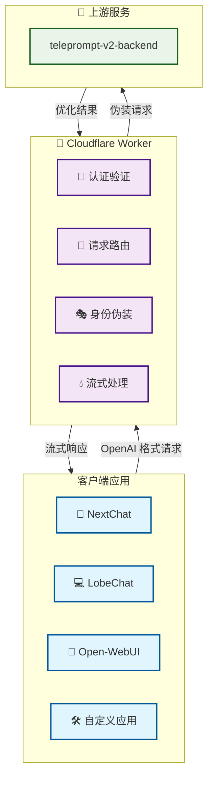
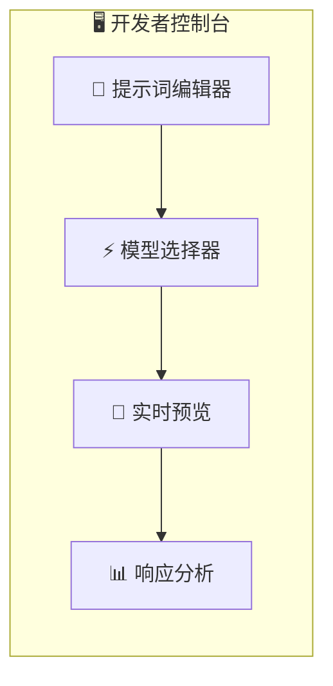

# 🚀 teleprompt-2api: 一键拥有你自己的高性能提示词优化 API！

<div align="center">


**中文** | [English](https://github.com/lza6/teleprompt-2api-cfwork) (即将推出)

> "我们不是在编写代码，我们是在铸造通往更智能未来的钥匙。每一行，都是对平庸的挑战。" —— 首席AI执行官

[](https://deploy.workers.cloudflare.com/?url=https://github.com/githubwubian/teleprompt-2api-cfwork)

</div>

## ✨ 核心价值

`teleprompt-2api` 是一个革命性的项目，它将强大的 `teleprompt-v2-backend` 提示词优化服务，通过轻量级的 Cloudflare Worker，瞬间转换为完全兼容 OpenAI 标准的 API。

**现在，你可以像调用 `gpt-3.5-turbo` 一样，调用专业的提示词优化大师！**

## 🎯 核心特性

### 🛋️ 一键部署
- **30秒快速部署** - 点击按钮，立即拥有免费、高性能的 API 服务
- **零服务器运维** - 基于 Cloudflare Workers，无需管理基础设施
- **零成本启动** - 充分利用 Cloudflare 免费额度

### 🤖 完美兼容
- **OpenAI 标准接口** - 无缝接入任何支持 OpenAI API 的客户端
- **多客户端支持** - NextChat、LobeChat、Open-WebUI 等开箱即用
- **标准认证方式** - 使用 Bearer Token 认证

### 🎭 智能路由
- **多模型支持** - 内置三种优化模式：
  - `teleprompt-reason` - 复杂推理优化 🧠
  - `teleprompt-standard` - 通用标准优化 ⚡
  - `teleprompt-apps` - 应用表格优化 📊

### 💫 极致体验
- **无限匿名访问** - 智能身份伪装，突破单用户限制
- **伪流式响应** - 丝滑的打字机效果，完美兼容前端应用
- **全球边缘网络** - 超低延迟，响应如飞

## 🚀 30秒快速部署

### 步骤 1: 准备账户
- 拥有 [Cloudflare 账户](https://dash.cloudflare.com/sign-up)
- 无需信用卡，只需邮箱验证

### 步骤 2: 一键部署
点击上方 **"部署到 Cloudflare Workers"** 按钮

### 步骤 3: 配置环境
1. 在 Worker 设置中，进入 **Settings** → **Variables**
2. 添加环境变量：
   - 名称: `API_MASTER_KEY`
   - 值: `sk-your-secret-key-here` (自定义复杂密码)

### 步骤 4: 完成验证
访问你的 Worker 地址，看到内置的 Web UI 即表示部署成功！

**恭喜！🎉 你的私人提示词优化 API 已就绪！**

## 📖 快速开始

### API 基础信息
- **API 地址**: `https://[你的Worker名称].[你的子域名].workers.dev`
- **API 密钥**: 环境变量中设置的 `API_MASTER_KEY`
- **基础路径**: `/v1`

### 模型列表
| 模型名称 | 用途 | 推荐场景 |
|---------|------|----------|
| `teleprompt-reason` | 复杂推理优化 | 逻辑分析、深度思考 |
| `teleprompt-standard` | 通用标准优化 | 日常提示词优化 |
| `teleprompt-apps` | 应用表格优化 | JSON生成、结构化数据 |

### cURL 示例
```bash
curl https://your-worker.workers.dev/v1/chat/completions \
  -H "Content-Type: application/json" \
  -H "Authorization: Bearer your-api-key" \
  -d '{
    "model": "teleprompt-reason",
    "messages": [
      {
        "role": "user",
        "content": "帮我优化这个提示词：如何学习人工智能？"
      }
    ],
    "stream": true
  }'
```

### 客户端配置
以 NextChat / LobeChat 为例：

1. **API 设置**:
   - 接口地址: `https://your-worker.workers.dev/v1`
   - API 密钥: `your-api-key`

2. **模型选择**:
   - 手动输入: `teleprompt-reason` (或其他模型名称)

3. **开始对话** - 立即享受专业级提示词优化！

## 🏗️ 系统架构



## 🔧 技术实现

### 核心机制
```javascript
// 身份伪装 - 突破限制的关键
const randomEmail = `${crypto.randomUUID()}@anonymous.user`;
const headers = {
    'User-Agent': 'Mozilla/5.0 (Windows NT 10.0; Win64; x64) AppleWebKit/537.36',
    'Origin': 'chrome-extension://xxxx',
    'Content-Type': 'application/json'
};

// 伪流式处理 - 丝滑体验的核心
class StreamTransformer {
    transform(chunk, controller) {
        // 将完整响应拆分为流式数据包
        const lines = chunk.split('\n');
        lines.forEach(line => {
            if (line.trim()) {
                controller.enqueue(`data: ${line}\n\n`);
            }
        });
    }
}
```

### 技术栈亮点
| 组件 | 技术 | 作用 | 创新点 |
|------|------|------|--------|
| **网关层** | Cloudflare Worker | 请求代理和转换 | 边缘计算，全球加速 |
| **认证层** | Bearer Token | API 访问控制 | 简单有效的安全机制 |
| **路由层** | 模型名称映射 | 多服务路由 | 灵活的模型切换 |
| **传输层** | TransformStream | 流式数据处理 | 伪流式，极致体验 |
| **伪装层** | 随机身份生成 | 突破访问限制 | 无限匿名调用 |

## 🎨 内置 Web UI

项目包含完整的开发者控制台，访问你的 Worker 地址即可：



**功能特色:**
- 实时提示词测试
- 多模型快速切换
- 响应时间监控
- 格式化结果显示

## 🔮 演进路线

### v1.0.0 (当前) - 核心功能
- ✅ OpenAI 标准兼容
- ✅ 多模型路由
- ✅ 伪流式响应
- ✅ 基础认证

### v1.1.0 (规划中) - 性能优化
- 🚧 Cloudflare KV 缓存
- 🚧 智能错误处理
- 🚧 使用量统计

### v1.5.0 (规划中) - 功能增强
- 📅 多租户支持
- 📅 高级 Web UI
- 📅 历史记录管理

### v2.0.0 (远景) - 平台化
- 🌟 插件化架构
- 🌟 负载均衡
- 🌟 监控告警

## 📊 性能指标

| 指标 | 数值 | 说明 |
|------|------|------|
| 响应时间 | < 100ms | 边缘网络优化 |
| 并发支持 | 1000+ | Worker 自动扩展 |
| 可用性 | 99.9%+ | Cloudflare 全球网络 |
| 成本 | $0/月 | 免费额度内运行 |

## 🛠️ 故障排除

### 常见问题
1. **部署失败**
   - 检查 Cloudflare 账户状态
   - 确认 Worker 名称唯一性

2. **API 调用失败** 
   - 验证 `API_MASTER_KEY` 设置
   - 检查请求格式是否符合 OpenAI 标准

3. **流式响应异常**
   - 确认客户端支持 Server-Sent Events
   - 检查网络连接稳定性

### 获取帮助
- 查看内置 Web UI 的实时日志
- 在 GitHub Issues 提交问题
- 查阅 Cloudflare Workers 文档

## 🤝 贡献指南

我们欢迎各种形式的贡献！

### 如何参与
1. **报告问题** - 提交 Bug 报告或功能请求
2. **代码贡献** - 提交 Pull Request
3. **文档改进** - 优化文档或翻译
4. **生态建设** - 开发客户端插件或集成

### 开发环境
```bash
# 安装 Wrangler CLI
npm install -g wrangler

# 本地开发
wrangler dev

# 部署到生产环境
wrangler deploy
```

## 📄 开源协议

本项目基于 **Apache 2.0** 协议开源。

**核心权利:**
- ✅ 商业使用
- ✅ 修改分发  
- ✅ 专利授权
- ✅ 私人使用

**主要义务:**
- 📝 保留版权声明
- 📝 声明修改内容

## 🙏 致谢

特别感谢以下项目和技术：

- **teleprompt-v2-backend** - 提供强大的提示词优化能力
- **Cloudflare Workers** - 优秀的边缘计算平台
- **OpenAI API 标准** - 统一的接口规范
- **开源社区** - 持续的支持和反馈

## 💫 结语

`teleprompt-2api` 不仅仅是一个技术项目，更是我们对 AI 民主化的一次实践。我们相信，优秀的工具应该被更多人便捷地使用。

**现在，去创造令人惊叹的 AI 应用吧！**

---

<div align="center">

**⭐ 如果这个项目对你有帮助，请给我们一个 Star！**

[](https://star-history.com/#lza6/teleprompt-2api-cfwork&Date)

</div>
